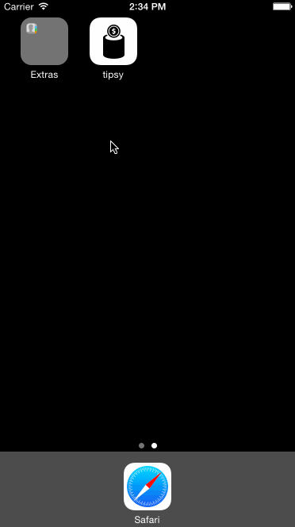

# Project-01-Tipsy

<b> Description </b>
A simple tip calculator that quickly lets you calculate your tip and total. You can choose a tip % between - 18%, 20% and 22%.

<b> Hours spent </b>
Approximately 10 - 12

<b> Additional Work (beyond assignment) </b>
I played around a lot with UI and visual elements. Here is a list of subtle nuances that I added to improve the experience.
1. Visual effect of blurring the loading screen as background

2. Always have a $ sign show for the input value

3. Have the tip % segmented button be hidden and show only when required

4. Animating most UI elements to achieve a smooth experience.

5. Enable autolayout to optimize experience for iPhone 5, 5s, 6 and 6 Plus
 

<b> Demo </b>

-

